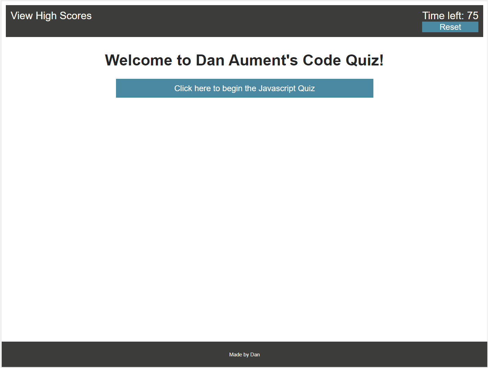

# Title: # 04-Code-Quiz-Dan-Aument-UT-Homework

## Table of Contents:
* [Description](#Description)
* [Screenshot](#Screenshot)
* [Location of Deployed Project](#Location)
* [Notes from Dan](#Notes)
* [Credits](#Credits)
* [License](#License)

### <a name="Description">Description:</a>
This project serves as a homework assignment submission for the fourth week of UT's web dev coding bootcamp.  It contains a codebase and a deployed webpage for a quiz web app.

### <a name="Screenshot">Screenshot: </a>

### <a name="Location">Location of Deployed Project:</a>
https://danaument.github.io/Code-Quiz/

### <a name="Notes">Notes from Dan:  </a>

This was my second major project with JavaScript.  I had a lot of fun coding line after line at the start, thinking about how amazing my functions were and how well they were going to work together.  Sadly, that was not to be the case.  I developed a separate repository about halfway through this assignment where I could pull out individual lines of code and see how they worked (if at all).  I will continue this method in the future.

The assignment requirements seemed achievable, so I added a few of my own.  I decided to format my question and answer database all within an object of arrays of objects of arrays, etc. This required me to build the quiz pages using for loops, as my questions could have variable amounts of answers.  I also made a function that took an integer input (x) and generated a shuffled array of all the integers from 0 to x, including 0 but not x (with no repeated values).  I used this function to generate arrays that I could then loop through as I built out my questions and answers - allowing the question order and answer orders to be random.  

The high score values are stored in session storage, and I did not include a button to clear session storage yet.  Several other values are stored there as well, which is unnecessary but fun with which to practice.

Finally, I completed this assignment during the week of the election of 2020, so my mind was definitely occupied elsewhere.

### <a name="Credits">Credits: </a>
This project was completed by Dan Aument with help from his friend, Aaron Wolfe, using code and assets provided by The Coding Boot Camp at UT Austin in partnership with Trilogy Education Services.  I owe Aaron some beer.

I shamelessly copied my quiz questions from w3schools.com's own JavaScript test.

### <a name="License">License: </a>

Distributed under the MIT License

MIT License

Copyright (c) 2020 Daniel Aument

Permission is hereby granted, free of charge, to any person obtaining a copy
of this software and associated documentation files (the "Software"), to deal
in the Software without restriction, including without limitation the rights
to use, copy, modify, merge, publish, distribute, sublicense, and/or sell
copies of the Software, and to permit persons to whom the Software is
furnished to do so, subject to the following conditions:

The above copyright notice and this permission notice shall be included in all
copies or substantial portions of the Software.

THE SOFTWARE IS PROVIDED "AS IS", WITHOUT WARRANTY OF ANY KIND, EXPRESS OR
IMPLIED, INCLUDING BUT NOT LIMITED TO THE WARRANTIES OF MERCHANTABILITY,
FITNESS FOR A PARTICULAR PURPOSE AND NONINFRINGEMENT. IN NO EVENT SHALL THE
AUTHORS OR COPYRIGHT HOLDERS BE LIABLE FOR ANY CLAIM, DAMAGES OR OTHER
LIABILITY, WHETHER IN AN ACTION OF CONTRACT, TORT OR OTHERWISE, ARISING FROM,
OUT OF OR IN CONNECTION WITH THE SOFTWARE OR THE USE OR OTHER DEALINGS IN THE
SOFTWARE.